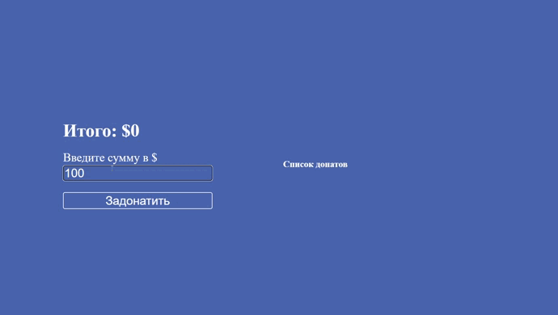

# 💰 Donation Tracker | Трекер донатов

Интерактивное приложение для учета и управления донатами, разработанное на чистом JavaScript с использованием кастомной компонентной архитектуры. Проект демонстрирует продвинутые навыки работы с DOM, управлением состоянием и модульной структурой.


## ✨ Возможности

- **💵 Добавление донатов** Ввод суммы от 1 до 100 долларов
- **📊 Отслеживание общей суммы** Автоматический расчет итоговой суммы
- **🗑️ Удаление записей** Возможность удалять отдельные донаты
- **📅 Временные метки** Автоматическое добавление даты и времени
- **📱 Адаптивный дизайн** Оптимальное отображение на всех устройствах
- **⚡ Валидация ввода** Проверка корректности вводимых данных

## 🎥 Демонстрация работы

<!-- ВСТАВЬТЕ ВАШУ GIF-АНИМАЦИЮ ЗДЕСЬ -->

<!-- ЗАМЕНИТЕ ВЫШЕСТОЯЩУЮ ССЫЛКУ НА ВАШУ REAL GIF -->

> *На GIF показано: добавление донатов, автоматический пересчет суммы, удаление записей, адаптивный интерфейс*

## 🛠️ Технологический стек

### Архитектура
- **Кастомная компонентная система** - Собственная реализация компонентов (класс `Component`)
- **Модульная структура** - Четкое разделение на компоненты, утилиты и ядро
- **Событийная модель** - Продвинутая система обработки событий

### Frontend
- **Vanilla JavaScript ES6+** - Современный JavaScript без фреймворков
- **ООП подход** - Классы и наследование для компонентов
- **DOM Manipulation** - Прямая работа с элементами страницы

### Инструменты сборки
- **Webpack 5** - Модульный сборщик проекта
- **Babel** - Транспиляция JavaScript для совместимости
- **CSS Loader** - Обработка стилей
- **Webpack Dev Server** - Development сервер с hot reload

### Стилизация
- **Pure CSS** - Кастомные стили с CSS переменными
- **CSS Grid & Flexbox** - Современная верстка
- **Адаптивный дизайн** - Mobile-first подход

## 📁 Структура проекта
 src/
    ├── components/          # Компоненты приложения
    │   ├── App.js          # Корневой компонент
    │   ├── Form.js         # Форма ввода донатов
    │   ├── List.js         # Список донатов
    │   └── ListItem.js     # Элемент списка
    ├── core/
    │   └── Component.js    # Базовый класс компонента
    ├── utils/
    │   └── toNumber.js     # Вспомогательные функции
    ├── index.css           # Глобальные стили
    ├── index.html          # HTML шаблон
    └── index.js            # Точка входа


## 🚀 Быстрый старт

1. **Клонируйте репозиторий**
```bash
git clone https://github.com/your-username/donation-tracker.git
```
2.**Установите зависимости**
```bash
pnpm install
```
3.**Запустите development сервер**
```bash
npm start
```


