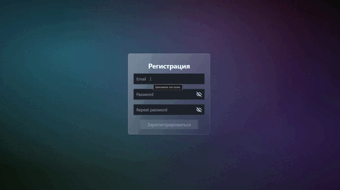

# 🔐 Cosmic Registration Form | Форма регистрации с валидацией

Современная и элегантная форма регистрации с расширенной валидацией, разработанная на React с TypeScript. Проект демонстрирует лучшие практики работы с формами, валидацией и созданием immersive UI с космическим дизайном.


## ✨ Возможности

- **📧 Валидация email** Проверка корректности формата email
- **🔐 Валидация пароля** Минимальная длина 6 символов
- **🔄 Подтверждение пароля** Сравнение паролей на совпадение
- **👁️ Видимость пароля** Переключение видимости пароля
- **🎯 Валидация в реальном времени** Instant feedback при вводе
- **🚫 Блокировка кнопки** Кнопка неактивна при невалидной форме
- **🌌 Космический дизайн** Immersive background с градиентами
- **📱 Адаптивный интерфейс** Оптимальное отображение на всех устройствах

## 🎥 Демонстрация работы

<!-- ВСТАВЬТЕ ВАШУ GIF-АНИМАЦИЮ ЗДЕСЬ -->

<!-- ЗАМЕНИТЕ ВЫШЕСТОЯЩУЮ ССЫЛКУ НА ВАШУ REAL GIF -->

> *На GIF показано: процесс заполнения формы, валидация полей, переключение видимости пароля, работа с ошибками*

## 🛠️ Технологический стек

### Frontend Framework
- **React 18** - Современная версия с Strict Mode
- **TypeScript** - Полная типизация для надежности
- **React Hook Form** - Эффективное управление формами
- **Yup** - Схемы валидации

### Стилизация & UI
- **Tailwind CSS** - Утилитарный CSS фреймворк
- **DaisyUI** - Компонентная библиотека (тема Synthwave)
- **Lucide React** - Современные иконки
- **Custom CSS** - Кастомные стили и анимации

### Валидация
- **Yup Schema Validation** - Декларативные схемы валидации
- **React Hook Form Resolvers** - Интеграция валидации с формами
- **Real-time Validation** - Валидация при onChange

### Инструменты разработки
- **Vite** - Быстрый сборщик проекта
- **ESLint** - Линтинг кода
- **TypeScript ESLint** - Линтинг TypeScript

## 📁 Структура проекта
```
src/
├── components/
│ ├── PasswordInput/
│ │ └── PasswordInput.tsx # Компонент поля пароля
│ └── Background.tsx # Космический background
├── schema/
│ └── schema.ts # Yup схемы валидации
├── types/
│ └── type.ts # TypeScript интерфейсы
├── App.tsx # Основной компонент
├── index.css # Глобальные стили
└── main.tsx # Точка входа
```
