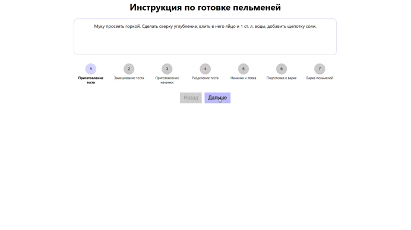

# 🥟 Cooking Steps Guide | Интерактивный гид по готовке пельменей

Интерактивное приложение-гид по шагам приготовления пельменей, разработанное на React с современным CSS. Проект демонстрирует создание пользовательских интерфейсов с пошаговой навигацией, состоянием компонентов и плавными переходами.


## ✨ Возможности

- **📋 Пошаговая навигация** Интуитивное перемещение между этапами готовки
- **🎯 Визуальный прогресс** Цветовая индикация активного и завершенных шагов
- **🔄 Интерактивные элементы** Кликабельные шаги и кнопки навигации
- **🎨 Современный UI** Чистый и минималистичный интерфейс
- **⚡ Быстрые переходы** Мгновенная смена шагов без перезагрузки

## 🎥 Демонстрация работы

<!-- ВСТАВЬТЕ ВАШУ GIF-АНИМАЦИЮ ЗДЕСЬ -->

<!-- ЗАМЕНИТЕ ВЫШЕСТОЯЩУЮ ССЫЛКУ НА ВАШУ REAL GIF -->

> *На GIF показано: переходы между шагами, индикация прогресса, работа кнопок навигации*

## 🛠️ Технологический стек

### Frontend Framework
- **React 19** - Современная версия с Strict Mode


### Стилизация
- **CSS Modules** - Локальная область видимости стилей
- **CSS Variables** - Кастомные свойства для темизации
- **Flexbox** - Современная верстка

### Инструменты разработки
- **Vite** - Быстрый сборщик проекта
- **ESLint** - Линтинг кода
- **CSS Modules** - Изоляция стилей компонентов

### Архитектура
- **Компонентный подход** - Модульная структура приложения
- **Импорт данных** - Внешний JSON файл с контентом

## 📁 Структура проекта
```
src/
├── App.jsx # Основной компонент приложения
├── App.module.css # Стили компонента (CSS Modules)
├── index.css # Глобальные стили и CSS переменные
├── main.jsx # Точка входа приложения
└── data.json # Данные шагов приготовления
```
