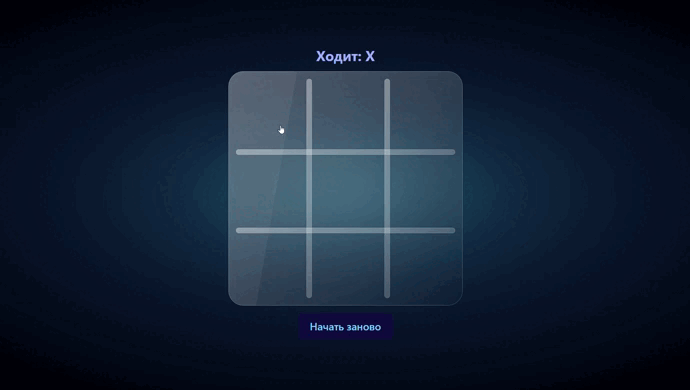

# ⭕❌ Cosmic Tic-Tac-Toe | Космические крестики-нолики

Иммерсивная игра в крестики-нолики с космическим дизайном, разработанная на React с TypeScript. Проект демонстрирует продвинутые навыки управления состоянием, компонентной архитектурой и созданием визуально привлекательных интерфейсов.


## ✨ Возможности

- **🎮 Классическая игра** Полнофункциональные крестики-нолики 3x3
- **🌌 Космический дизайн** Иммерсивный фон с глубоким космосом
- **⚡ Instant feedback** Мгновенная реакция на ходы
- **🏆 Определение победителя** Автоматическое определение выигрышных комбинаций
- **🤝 Ничья** Обнаружение ситуации "ничьей"
- **🔄 Рестарт игры** Кнопка для начала новой игры
- **🎨 Анимации** Плавные переходы и визуальные эффекты

## 🎥 Демонстрация работы

<!-- ВСТАВЬТЕ ВАШУ GIF-АНИМАЦИЮ ЗДЕСЬ -->

<!-- ЗАМЕНИТЕ ВЫШЕСТОЯЩУЮ ССЫЛКУ НА ВАШУ REAL GIF -->

> *На GIF показано: процесс игры, определение победителя, рестарт игры, космический дизайн*

## 🛠️ Технологический стек

### Frontend Framework
- **React 19** + **TypeScript** - Статическая типизация и современные хуки

### Стилизация & UI
- **Tailwind CSS** - Утилитарный CSS фреймворк
- **DaisyUI** - Компонентная библиотека (тема Synthwave)
- **Lucide React** - Современные векторные иконки
- **Custom CSS** - Кастомные анимации и эффекты

### Архитектура
- **Component-Based Architecture** - Модульная структура компонентов
- **Container-Presenter Pattern** - Разделение логики и представления
- **Custom Hooks** - Логика управления состоянием игры

### Логика игры
- **WIN_PATTERNS** - Предопределенные выигрышные комбинации
- **State Management** - Локальное состояние с useState
- **Game Rules** - Полная реализация правил игры

## 📁 Структура проекта
```
src/
├── components/
│ ├── Field/
│ │ ├── FieldContainer.tsx # Логика игрового поля
│ │ └── FieldLayout.tsx # Представление поля
│ ├── Information/
│ │ ├── InformationContainer.tsx # Логика информации
│ │ └── InformationLayout.tsx # Представление информации
│ ├── Background.tsx # Космический фон
│ ├── XMark.tsx # Компонент крестика
│ ├── OMark.tsx # Компонент нолика
│ └── index.ts # Barrel exports
├── game.config.ts # Конфигурация игры
├── App.tsx # Корневой компонент
└── main.tsx # Точка входа
```
