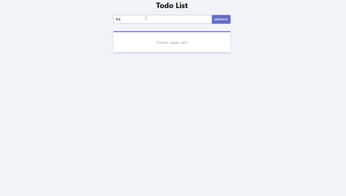

# ✅ Vue Todo List | Умный менеджер задач

Производительное и элегантное приложение для управления задачами, разработанное на Vue 3 с TypeScript. Проект демонстрирует современные подходы к разработке: Composition API, кастомные хуки, работа с REST API и реактивное управление состоянием.


## ✨ Возможности

- **📝 Добавление задач** Быстрое создание новых задач с валидацией
- **✅ Отметка выполнения** Визуальное обозначение завершенных задач
- **🗑️ Удаление задач** Удаление одиночных или групп задач
- **📊 Статистика** Автоматический подсчет активных задач
- **🔄 REST API** Полная CRUD функциональность с JSON Server
- **⚡ Реактивность** Мгновенное обновление интерфейса
- **🎨 Чистый UI** Минималистичный и интуитивный интерфейс


## 🎥 Демонстрация работы

<!-- ВСТАВЬТЕ ВАШУ GIF-АНИМАЦИЮ ЗДЕСЬ -->

<!-- ЗАМЕНИТЕ ВЫШЕСТОЯЩУЮ ССЫЛКУ НА ВАШУ REAL GIF -->

> *На GIF показано: добавление задач, отметка выполнения, удаление задач, работа с API*

## 🛠️ Технологический стек

### Frontend Framework
- **Vue 3** - Composition API и реактивная система
- **TypeScript** - Полная типизация для надежности кода
- **Vue Components** - Модульная компонентная архитектура

### State Management
- **Composition API** - Логика в composable функциях
- **Reactive State** - Реактивные переменные и computed свойства
- **Custom Hooks** - useTodos и useFetch для разделения логики

### Backend & API
- **JSON Server** - Полнофункциональный REST API
- **Fetch API** - Современные HTTP запросы
- **CRUD Operations** - Create, Read, Update, Delete

### Архитектура
- **Composables** - Кастомные хуки для бизнес-логики
- **Component Separation** - Разделение логики и представления
- **Type Safety** - Полная типизация данных и функций

## 📁 Структура проекта
```
src/
├── components/
│ ├── TodoForm.vue # Форма добавления задач
│ └── TodoListItem.vue # Элемент списка задач
├── composables/
│ ├── useFetch.ts # Хук для HTTP запросов
│ └── useTodos.ts # Основная логика задач
├── constants/
│ └── constants.ts # Константы приложения
├── types/
│ └── type.ts # TypeScript интерфейсы
├── App.vue # Корневой компонент
├── main.ts # Точка входа
└── style.css # Стили приложения
```
