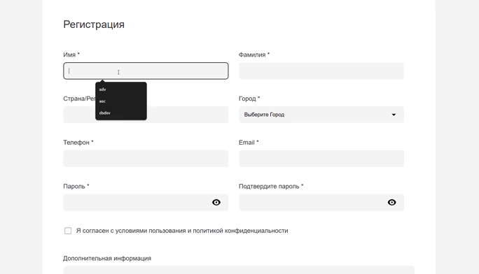

# 📝 Vue Registration Form | Умная форма регистрации

Профессиональная форма регистрации с полной валидацией и интеграцией с Firebase, разработанная на Vue 3 с TypeScript. Проект демонстрирует современные подходы к работе с формами, валидацией и облачной базой данных.


## ✨ Возможности

- **📋 Полная форма регистрации** 10+ полей с comprehensive валидацией
- **🎯 Валидация в реальном времени** Instant feedback при вводе
- **☁️ Cloud Firestore** Сохранение данных в облачной базе Firebase
- **🔐 Валидация паролей** Проверка совпадения и сложности пароля
- **📞 Валидация телефона** Проверка российских номеров телефонов
- **🌍 Выбор городов** Dropdown с predefined городами России
- **📝 Комментарии** Многострочное текстовое поле
- ✅ **Соглашение с условиями** Обязательное подтверждение

## 🎥 Демонстрация работы

<!-- ВСТАВЬТЕ ВАШУ GIF-АНИМАЦИЮ ЗДЕСЬ -->

<!-- ЗАМЕНИТЕ ВЫШЕСТОЯЩУЮ ССЫЛКУ НА ВАШУ REAL GIF -->

> *На GIF показано: заполнение формы, валидация полей, отправка данных, работа с ошибками*

## 🛠️ Технологический стек

### Frontend Framework
- **Vue 3** - Composition API и реактивная система
- **TypeScript** - Полная типизация для надежности кода
- **Vite** - Быстрый сборщик проекта

### Валидация
- **Yup** - Мощная библиотека валидации схем
- **Custom Validation** - Кастомные правила валидации
- **Real-time Validation** - Мгновенная обратная связь

### Backend & Database
- **Firebase Firestore** - Cloud NoSQL база данных
- **Firebase SDK** - Официальная интеграция с Firebase
- **CRUD Operations** - Create и Read операции

### Стилизация
- **Pure CSS** - Кастомные стили без фреймворков
- **CSS Grid & Flexbox** - Современная верстка
- **Responsive Design** - Адаптивный дизайн

## 📁 Структура проекта
```
src/
├── constants/
│ └── constants.ts # Начальные данные формы
├── schema/
│ └── validateSchema.ts # Yup схемы валидации
├── types/
│ └── types.ts # TypeScript интерфейсы
├── utils/
│ ├── addData.ts # Функции добавления данных
│ └── fetchData.ts # Функции получения данных
├── main.ts # Точка входа
└── style.css # Стили приложения
```
